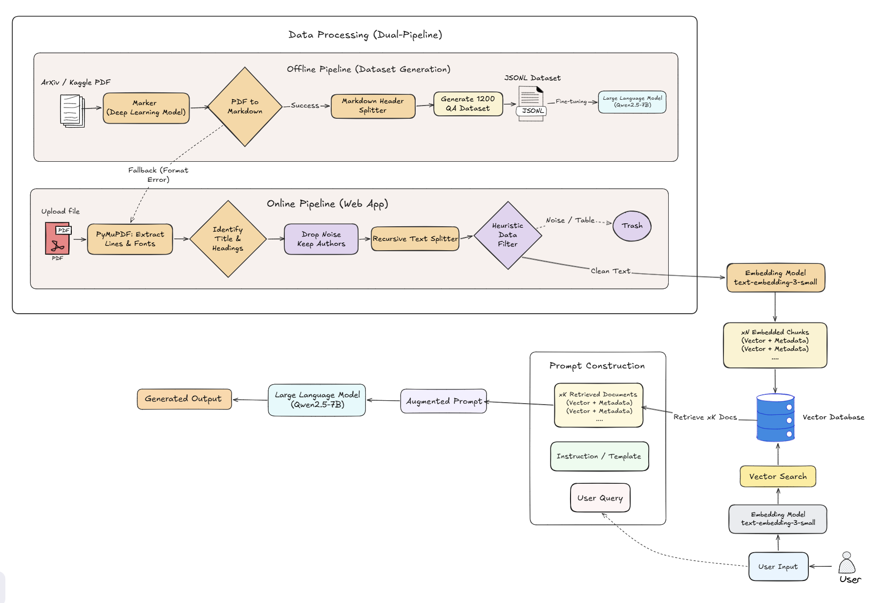
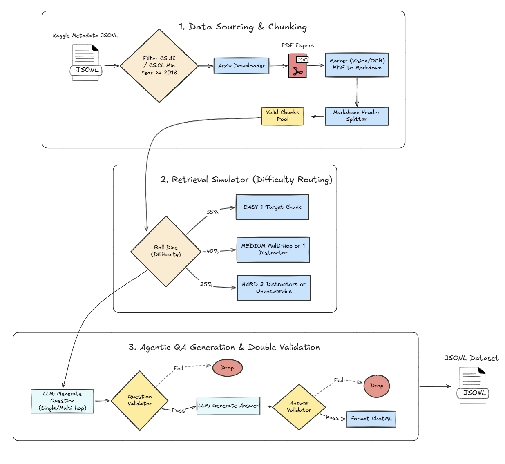

# Research Operating System - ResearchOS

An intelligent, end-to-end scientific research assistant designed to parse, analyze, and extract deep insights from academic papers. ResearchOS acts as an interactive workspace where researchers can upload PDFs and perform highly contextual Q&A using Large Language Models (LLMs).

---

## System Architecture

The system follows a **Modular** design with four main components:

- **Frontend (React, Vite, TailwindCSS)**: Interactive UI with dynamic rendering based on question language, integrated PDF Viewer and Chat Assistant.
- **Backend (FastAPI)**: API Server handling business logic via `main.py`, `schemas/` (Pydantic validation), and `service/` (core RAG/LLM/Chunking logic).
- **Data & Storage**: `data/uploads/` for raw PDFs, **ChromaDB** as the persistent vector store.
- **AI Models**:
  - `text-embedding-3-small` (OpenAI) — vector embeddings
  - `gpt-4o-mini` (OpenAI) — JSON extraction, paper analysis, and dataset generation
  - `Qwen2.5-7B-Instruct` — local LLM via Ollama for RAG Q&A



---

## Project Structure

```text
├── frontend/                  # React & Vite frontend application
├── main.py                    # FastAPI entry point: defines all API routes (/upload, /chat, etc.)
├── config/
│   └── dataset_config.yaml    # Parameters for dataset generation (n_papers, categories, etc.)
├── schemas/
│   ├── chunk.py               # Chunk & ChunkMetadata models
│   ├── document.py            # Document upload/response models
│   ├── paper.py               # Paper metadata models
│   ├── rag.py                 # RAG query/response models (QuestionRequest, AnswerResponse, AnalyzeRequest)
│   └── section.py             # Section extraction models
├── service/                   # Core Business & RAG Logic
│   ├── rag_service.py         # Orchestrates the full RAG pipeline (retrieve → generate)
│   ├── document_service.py    # PDF ingestion: parsing & storing
│   ├── chunking.py            # Section extraction & text splitting logic
│   ├── embedding_service.py   # OpenAI embedding calls
│   ├── chroma_service.py      # ChromaDB operations (upsert, query, delete)
│   └── llm_service.py         # LLM API calls & prompt formatting
├── prompt/
│   ├── answer_validator_prompt.py   # AI Agent prompt to validate generated answers
│   ├── multi_hop_prompt.py          # Prompt to generate complex, multi-chunk questions
│   ├── question_validator_prompt.py # AI Agent prompt to filter out bad questions
│   ├── rag_prompt.py                # System prompt template for contextual RAG Q&A
│   ├── router_prompt.py             # Prompt to route Local vs Global queries
│   ├── single_hop_prompt.py         # Prompt to generate simple, direct questions
│   └── unanswerable_prompt.py       # Prompt to generate tricky questions without context
├── dataset_builder/           # Offline pipeline for generating SFT fine-tuning dataset
│   ├── build_dataset.py       # Entry point: reads config/dataset_config.yaml → runs pipeline
│   ├── dataset_builder.py     # Orchestrator: download → chunk → generate → write JSONL
│   ├── qa_generator.py        # Generates reasoning-heavy Q&A pairs via OpenAI
│   ├── retrieval_simulator.py # Simulates RAG retrieval difficulty (EASY/MEDIUM/HARD)
│   └── arxiv_downloader.py    # Downloads PDFs from arXiv by paper ID
├── utils/
│   └── processing_pdf.py      # PDF pre-processing helpers
├── data/
│   ├── chroma/                # Persisted ChromaDB vector store
│   ├── uploads/               # Temporary storage for uploaded PDFs
│   └── dataset.jsonl          # Generated SFT dataset
├── notebook/                  # For run pipeline: Dataset generation, QLoRA fine-tuning and evaluation
├── Modelfile                  # Ollama Modelfile for loading the fine-tuned GGUF model
├── pyproject.toml             # Python dependency management (used with `uv`)
├── Makefile                   # Shortcuts: `make backend`, `make frontend`, `make dataset`
└── .env.example               # Template for required environment variables
```

---

## How to Run Locally

Follow these steps to launch the entire ResearchOS system (AI Model, Backend, and Frontend) on your local machine.

### 1. Start the Fine-Tuned AI Model
You can run the GGUF model either entirely locally (if you have a dedicated GPU) or via Google Colab.

**Option A: Run Locally (Recommended for machines with GPU)**
1. Install [Ollama](https://ollama.com/) on your machine.
2. Open a terminal in the `backend/` folder and build the model using the provided Modelfile:
   ```bash
   ollama create qwen2.5-rag -f Modelfile
   ```

**Option B: Run on Google Colab (For machines without GPU)**
1. Upload and open the [`notebook/ResearchOS_ngrok.ipynb`](notebook/ResearchOS_ngrok.ipynb) notebook in Google Colab.
2. Insert your Ngrok Auth Token in the designated cell (Step 7).
3. Run all cells to start the Ollama server and download the GGUF model.
4. Copy the generated public Ngrok URL (e.g., `https://xxxx.ngrok-free.app/v1`).

### 2. Configure Environment Variables
Copy the template environment file:
```bash
cp .env.example .env
```
Open the `.env` file and set the `OLLAMA_BASE_URL` based on your chosen option:
```env
# If using Option A (Local):
OLLAMA_BASE_URL="http://localhost:11434/v1"

# If using Option B (Colab + Ngrok):
# OLLAMA_BASE_URL="https://xxxx.ngrok-free.app/v1"

# Also make sure to fill in your OPENAI_API_KEY
```

### 3. Start the Backend (FastAPI)
Open a terminal in the project root (`backend/` folder) and run:
```bash
# Install dependencies if you haven't already
uv sync

# Start the FastAPI backend server (runs on http://localhost:8000)
make backend
```

### 4. Start the Frontend (React UI)
Open a **new** terminal in the project root (`backend/` folder) and run:
```bash
# Start the Vite React development server
make frontend
```
*The interactive UI will now be accessible in your browser, typically at `http://localhost:5173`.*

## Building the Fine-Tuning Dataset

Edit [`config/dataset_config.yaml`](config/dataset_config.yaml) to configure `n_papers`, `categories`, and output path, then run:

```bash
make dataset

# To use a custom config file:
make dataset-config CONFIG=config/my_config.yaml
```

---

## Production Pipeline

### Document Ingestion

When a user uploads a PDF, the following steps run through `document_service.py` and `chunking.py`:

1. **Storage**: PDF saved to `data/uploads/` with a generated UUID (`file_id`).
2. **Text Extraction (Marker OCR)**: Uses `marker` to robustly convert PDFs into Markdown (preserving tables and formulas). Falls back to PyMuPDF (`fitz`) if Marker fails.
3. **Section Identification**: Noisy sections (`References`, `Acknowledgements`, `Appendix`, `Declarations`) are automatically filtered out using regex or font heuristics.
4. **Semantic Chunking**: `MarkdownHeaderTextSplitter` intelligently splits the paper by Markdown headers. If a section is still too long, `RecursiveCharacterTextSplitter` is applied (`chunk_size=700`, `overlap=150`).
5. **Embedding & Storage**: Each chunk is vectorized via `text-embedding-3-small` and stored in ChromaDB alongside metadata (`paper_id`, `section`, `page`, `chunk_index`).
6. **Full Paper Analysis**: `gpt-4o-mini` automatically extracts a structured JSON summary including Abstract, Metrics, Key Findings, and Glossary on upload.

### Retrieval-Augmented Generation (RAG)

When a user asks a question, `rag_service.py` uses an **Agentic Router** to classify the query intent:

```text
User Question
  → Router (classify_query) decides routing path: [LOCAL] or [GLOBAL]
  
  [If LOCAL - Specific factual search]:
    → Query Translation: Translates user question to an optimized English search query.
    → Embed English query (text-embedding-3-small)
    → Vector search ChromaDB (Top-K chunks)
    → Context Injection: Forcibly prepends Chunk 0 (Title/Authors) to context.
    → Qwen2.5-7B-Instruct generates answer.
    → 🔄 HYBRID FALLBACK: If Qwen returns INSUFFICIENT_INFORMATION, query is instantly routed to the GLOBAL path.
  
  [If GLOBAL - Summarization/Map-Reduce]:
    → Fetch ALL chunks for the paper.
    → Keyword Filtering: Keeps only chunks with Math/Table keywords if applicable.
    → Truncation: Caps at 100k tokens (keeps Abstract + Conclusion if oversized).
    → GPT-4o-mini generates comprehensive global summary.

  → API returns answer + precise source list (page & chunk references)
```

---

## Offline Pipeline: Dataset Builder



The fine-tuning dataset pipeline lives in `dataset_builder/`, configured via `config/dataset_config.yaml`:

1. **Data Sourcing**: Reads `arxiv-metadata.json` from the [Cornell University arXiv Dataset](https://www.kaggle.com/datasets/Cornell-University/arxiv) (Kaggle), filters by category (`cs.AI`, `cs.CL`), and auto-downloads PDFs via `ArxivDownloader`.
2. **Data Extraction & Chunking**: Uses **Marker** (a deep learning vision/OCR model) to convert PDFs into highly accurate Markdown (preserving tables and math formulas), then chunks using `MarkdownHeaderTextSplitter`. If Marker fails, it automatically falls back to the Production PyMuPDF pipeline.
3. **Reasoning-Heavy QA Generation** (`qa_generator.py`): Uses an Agentic workflow to generate `single_hop`, `multi_hop`, and `unanswerable` questions. It uses dual-validators (`question_validator`, `answer_validator`) to self-correct and filter out low-quality/extractive data.
4. **Retrieval Simulation** (`retrieval_simulator.py`): Distributes context difficulty:
   - **35% EASY**: 1 highly relevant chunk.
   - **40% MEDIUM**: 2 chunks with split information, or 1 correct + 1 distractor.
   - **25% HARD**: Multiple noisy chunks, or no relevant information (teaches the model to refuse and return `INSUFFICIENT_INFORMATION`).
5. **LLM Validator**: `gpt-4o-mini` reviews all generated pairs and removes hallucinated or trivially simple questions.
6. **Output**: JSONL file in ChatML format (`system`, `user`, `assistant`).

---

## Fine-Tuning (Supervised Fine-Tuning with QLoRA)

Training is done with **Unsloth** and **TRL SFTTrainer** on Google Colab (GPU T4), using QLoRA 4-bit quantization.

| Parameter | Value |
|---|---|
| Base Model | `unsloth/Qwen2.5-7B-Instruct` |
| Dataset | `xunnhi/QA-Dataset-Generator` (1156 samples, ChatML format) |
| Max Sequence Length | `2048` |
| Fine-Tuned Model | [`xunnhi/Qwen2.5-7B-RAG-LoRA`](https://huggingface.co/xunnhi/Qwen2.5-7B-RAG-LoRA) |
### Deploying the Fine-Tuned Model

After training, load the GGUF file into Ollama:

```bash
ollama create <model_name> -f Modelfile
```

Then update the `OLLAMA_BASE_URL` in `.env` to point the backend at the new model.

---

## Evaluation Results (50 Scenarios)

| Model | Faithfulness | Relevance | Refusal Accuracy |
|---|---|---|---|
| Fine-tuned Qwen2.5-7B (v1 - PyMuPDF Extraction) | 3.60 / 5.0 | 3.62 / 5.0 | 100% (10/10) |
| Fine-tuned Qwen2.5-7B (v2 - Marker + Semantic Chunking) | 4.16 / 5.0 | 4.20 / 5.0 | 90.0% (9/10) |

- **Faithfulness**: How closely the model sticks to provided context without hallucinating (0.0–5.0).
- **Relevance**: How directly the model addresses the specific query (0.0–5.0).
- **Refusal Accuracy**: Correctly returning `INSUFFICIENT_INFORMATION` when context is absent.

> Switching the PDF extraction pipeline from standard PyMuPDF to **Marker (OCR & Markdown)** combined with **Semantic Chunking (MarkdownHeaderTextSplitter)** significantly improved both Faithfulness and Relevance. By preserving the structural context of the papers (tables, math formulas, headers), the model is able to extract and synthesize information much more accurately.

---

## Tech Stack

| Layer | Technology |
|---|---|
| Framework | Python 3.11+, FastAPI, LangChain |
| Vector DB | ChromaDB (local persistent) |
| Document Processing | PyMuPDF (Online), Marker (Offline), Recursive/Markdown TextSplitters |
| Embeddings | OpenAI `text-embedding-3-small` |
| LLMs | OpenAI `gpt-4o-mini`, Qwen2.5-7B-Instruct (Ollama) |
| Fine-Tuning | Unsloth, TRL SFTTrainer, QLoRA |
| Evaluation | vLLM (Batch Inference), LLM-as-a-Judge (GPT-4o-mini) |
| Package Manager | `uv` |
