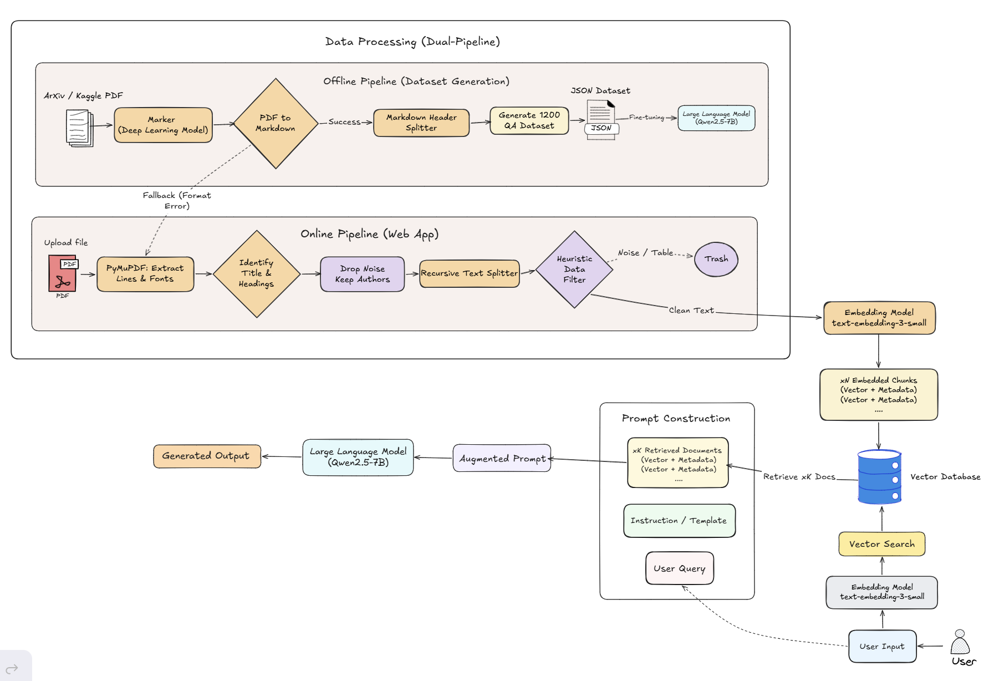

# Research Operating System - ResearchOS

An intelligent, end-to-end scientific research assistant designed to parse, analyze, and extract deep insights from academic papers. ResearchOS acts as an interactive workspace where researchers can upload PDFs and perform highly contextual Q&A using Large Language Models (LLMs).

---

## System Architecture

The system follows a **Modular** design with four main components:

- **Frontend (React, Vite, TailwindCSS)**: Interactive UI with dynamic rendering based on question language, integrated PDF Viewer and Chat Assistant.
- **Backend (FastAPI)**: API Server handling business logic via `main.py`, `schemas/` (Pydantic validation), and `service/` (core RAG/LLM/Chunking logic).
- **Data & Storage**: `data/uploads/` for raw PDFs, **ChromaDB** as the persistent vector store.
- **AI Models**:
  - `text-embedding-3-small` (OpenAI) — vector embeddings
  - `gpt-4o-mini` (OpenAI) — JSON extraction, paper analysis, and dataset generation
  - `Qwen2.5-7B-Instruct` — local LLM via Ollama for RAG Q&A



---

## Project Structure

```text
├── frontend/                  # React & Vite frontend application
├── main.py                    # FastAPI entry point: defines all API routes (/upload, /chat, etc.)
├── config/
│   └── dataset_config.yaml    # Parameters for dataset generation (n_papers, categories, etc.)
├── schemas/
│   ├── chunk.py               # Chunk & ChunkMetadata models
│   ├── document.py            # Document upload/response models
│   ├── paper.py               # Paper metadata models
│   ├── rag.py                 # RAG query/response models (QuestionRequest, AnswerResponse, AnalyzeRequest)
│   └── section.py             # Section extraction models
├── service/
│   ├── rag_service.py         # Orchestrates the full RAG pipeline (retrieve → generate)
│   ├── document_service.py    # PDF ingestion: parsing & storing
│   ├── chunking.py            # Section extraction & text splitting logic
│   ├── embedding_service.py   # OpenAI embedding calls
│   ├── chroma_service.py      # ChromaDB operations (upsert, query, delete)
│   └── llm_service.py         # LLM API calls & prompt formatting
├── prompt/
│   └── rag_prompt.py          # System prompt template for contextual Q&A
├── dataset_builder/           # Offline pipeline for generating SFT fine-tuning dataset
│   ├── build_dataset.py       # Entry point: reads config/dataset_config.yaml → runs pipeline
│   ├── dataset_builder.py     # Orchestrator: download → chunk → generate → write JSONL
│   ├── qa_generator.py        # Generates reasoning-heavy Q&A pairs via OpenAI
│   ├── retrieval_simulator.py # Simulates RAG retrieval difficulty (EASY/MEDIUM/HARD)
│   └── arxiv_downloader.py    # Downloads PDFs from arXiv by paper ID
├── utils/
│   └── processing_pdf.py      # PDF pre-processing helpers
├── data/
│   ├── chroma/                # Persisted ChromaDB vector store
│   ├── uploads/               # Temporary storage for uploaded PDFs
│   └── dataset.jsonl          # Generated SFT dataset
├── docs/                      # Technical documentation and guides
├── notebook/                  # For run pipeline: Dataset generation, QLoRA fine-tuning and evaluation
├── scripts/                   # Debugging and utility scripts
├── Modelfile                  # Ollama Modelfile for loading the fine-tuned GGUF model
├── pyproject.toml             # Python dependency management (used with `uv`)
├── Makefile                   # Shortcuts: `make run`, `make dataset`, `make dataset-config`
└── .env.example               # Template for required environment variables
```

---

## Quick Start

### 1. Environment Variables

Copy the example env file and populate your API keys:

```bash
cp .env.example .env
```

Set `OLLAMA_BASE_URL` in `.env`:
- Running Ollama locally: `http://localhost:11434/v1`
- Running Ollama on Google Colab via Ngrok: `https://xxxx.ngrok-free.app/v1`

### 2. Start the API Server

```bash
# Install dependencies (creates .venv automatically)
uv sync

# Activate the virtual environment
source .venv/bin/activate  # Windows: .venv\Scripts\activate

# Start the FastAPI server (runs on http://localhost:8000)
make run  # Or: PYTHONPATH=. uv run python main.py
```

### 3. Build the Fine-Tuning Dataset

Edit [`config/dataset_config.yaml`](config/dataset_config.yaml) to configure `n_papers`, `categories`, and output path, then run:

```bash
make dataset

# To use a custom config file:
make dataset-config CONFIG=config/my_config.yaml
```

---

## Production Pipeline

### Document Ingestion

When a user uploads a PDF, the following steps run through `document_service.py` and `chunking.py`:

1. **Storage**: PDF saved to `data/uploads/` with a generated UUID (`file_id`).
2. **Text Extraction**: PyMuPDF (`fitz`) reads each page and extracts raw text.
3. **Section Identification**: Headings detected via font size and bold formatting. Noisy sections (`References`, `Acknowledgements`, `Appendix`, `Declarations`) are automatically filtered.
4. **Semantic Chunking**: `RecursiveCharacterTextSplitter` splits text (`chunk_size=700`, `overlap=150`). Chunks that are too short or contain excessive noise characters are discarded.
5. **Embedding & Storage**: Each chunk is vectorized via `text-embedding-3-small` and stored in ChromaDB alongside metadata (`paper_id`, `section`, `page`, `chunk_index`).
6. **Full Paper Analysis**: `gpt-4o-mini` automatically extracts a structured JSON summary including Abstract, Metrics, Key Findings, and Glossary on upload.

### Retrieval-Augmented Generation (RAG)

When a user asks a question, `rag_service.py` uses an **Agentic Router** to classify the query intent:

```text
User Question
  → Router (classify_query) decides routing path: [LOCAL] or [GLOBAL]
  
  [If LOCAL - Specific factual search]:
    → Query Translation: Translates user question to an optimized English search query.
    → Embed English query (text-embedding-3-small)
    → Vector search ChromaDB (Top-K chunks)
    → Context Injection: Forcibly prepends Chunk 0 (Title/Authors) to context.
    → Qwen2.5-7B-Instruct generates answer.
    → 🔄 HYBRID FALLBACK: If Qwen returns INSUFFICIENT_INFORMATION, query is instantly routed to the GLOBAL path.
  
  [If GLOBAL - Summarization/Map-Reduce]:
    → Fetch ALL chunks for the paper.
    → Keyword Filtering: Keeps only chunks with Math/Table keywords if applicable.
    → Truncation: Caps at 100k tokens (keeps Abstract + Conclusion if oversized).
    → GPT-4o-mini generates comprehensive global summary.

  → API returns answer + precise source list (page & chunk references)
```

---

## Offline Pipeline: Dataset Builder

The fine-tuning dataset pipeline lives in `dataset_builder/`, configured via `config/dataset_config.yaml`:

1. **Data Sourcing**: Reads `arxiv-metadata.json` from the [Cornell University arXiv Dataset](https://www.kaggle.com/datasets/Cornell-University/arxiv) (Kaggle), filters by category (`cs.AI`, `cs.CL`), and auto-downloads PDFs via `ArxivDownloader`.
2. **Data Extraction & Chunking**: Uses **Marker** (a deep learning vision/OCR model) to convert PDFs into highly accurate Markdown (preserving tables and math formulas), then chunks using `MarkdownHeaderTextSplitter`. If Marker fails, it automatically falls back to the Production PyMuPDF pipeline.
3. **Reasoning-Heavy QA Generation** (`qa_generator.py`): Uses an Agentic workflow to generate `single_hop`, `multi_hop`, and `unanswerable` questions. It uses dual-validators (`question_validator`, `answer_validator`) to self-correct and filter out low-quality/extractive data.
4. **Retrieval Simulation** (`retrieval_simulator.py`): Distributes context difficulty:
   - **35% EASY**: 1 highly relevant chunk.
   - **40% MEDIUM**: 2 chunks with split information, or 1 correct + 1 distractor.
   - **25% HARD**: Multiple noisy chunks, or no relevant information (teaches the model to refuse and return `INSUFFICIENT_INFORMATION`).
5. **LLM Validator**: `gpt-4o-mini` reviews all generated pairs and removes hallucinated or trivially simple questions.
6. **Output**: JSONL file in ChatML format (`system`, `user`, `assistant`).

---

## Fine-Tuning (Supervised Fine-Tuning with QLoRA)

Training is done with **Unsloth** and **TRL SFTTrainer** on Google Colab (GPU T4), using QLoRA 4-bit quantization.

| Parameter | Value |
|---|---|
| Base Model | `unsloth/Qwen2.5-7B-Instruct` |
| Dataset | `xunnhi/QA-Dataset-Generator` (~700 samples, ChatML format) |
| Max Sequence Length | `2048` |
| Fine-Tuned Model | [`xunnhi/Qwen2.5-7B-RAG-LoRA`](https://huggingface.co/xunnhi/Qwen2.5-7B-RAG-LoRA) |
### Deploying the Fine-Tuned Model

After training, load the GGUF file into Ollama:

```bash
ollama create <model_name> -f Modelfile
```

Then update the `OLLAMA_BASE_URL` in `.env` to point the backend at the new model.

---

## Evaluation Results (50 Scenarios)

| Model | Faithfulness | Relevance | Refusal Accuracy |
|---|---|---|---|
| Fine-tuned Qwen2.5-7B | 3.60 / 5.0 | 3.62 / 5.0 | 100% (10/10) |

- **Faithfulness**: How closely the model sticks to provided context without hallucinating (0.0–5.0).
- **Relevance**: How directly the model addresses the specific query (0.0–5.0).
- **Refusal Accuracy**: Correctly returning `INSUFFICIENT_INFORMATION` when context is absent.

> The fine-tuned model achieves perfect refusal accuracy — it never hallucinates when context is missing. Comparison against OpenAI API baselines is pending.

---

## Tech Stack

| Layer | Technology |
|---|---|
| Framework | Python 3.11+, FastAPI, LangChain |
| Vector DB | ChromaDB (local persistent) |
| Document Processing | PyMuPDF (Online), Marker (Offline), Recursive/Markdown TextSplitters |
| Embeddings | OpenAI `text-embedding-3-small` |
| LLMs | OpenAI `gpt-4o-mini`, Qwen2.5-7B-Instruct (Ollama) |
| Fine-Tuning | Unsloth, TRL SFTTrainer, QLoRA |
| Package Manager | `uv` |
